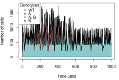
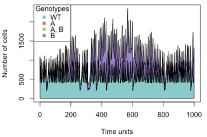
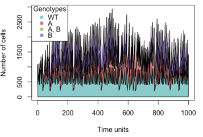

# Mutational constrains and adaptative therapy

This is an example inspired by Gingi and Wood, 2021. The current case shows how the fitness, in terms of cells grow, of a bacterial population depends on the probability of one strain mutate to another strain.

$$\frac{dn_i}{dt} = g_in_i - \mu n_i + \mu\sum^M_jm_{ji}n_j$$

$\mu$*:mutation rate*

$m_{ji}$*:probability that strain j mutates to strain i, given that there is a mutation in strain j*

The model consist of four genotypes and assumes a sequential pathway from ancestral to single mutants and then to double mutants:

-   WT: sensitive to both antibiotics

-   A: sensitive to drug B, resistant to drug A

-   B: resistant to drug B, sensitive to drug A

-   A,B: resistant to both drugs A and B

The genotypes were defined with an initial fitness for each (1.1(WT), 1.05 (A), 1.05 (B) and 1.01(A,B)) and the effect on that fitness of the probability (0.5) of mutating to other genotypes with a fixed mutation rate (0.01), in reference to the total size of the population (N):

```{r, eval=False}
dfat <- data.frame(Genotype = c("WT","B","A","B,A"),
                   Fitness = c("1.1-0.01*n_/N+n_A*0.01*0.5/N+n_B*0.01*0.5/N",
                             "1.05-0.01*n_B/N+n_*0.01*0.5/N+n_A_B*0.01*0.5/N",
                             "1.05-0.01*n_A/N +n_*0.01*0.5/N+n_A_B*0.01*0.5/N",
                             "1.01-0.01*n_A_B/N+n_B*0.01*0.5/N+n_A*0.01*0.5/N"))

afe2 <- allFitnessEffects(genotFitness = dfat,
                          frequencyDependentFitness = TRUE,
                          frequencyType = "abs")

evalAllGenotypes(afe2,spPopSizes = c(900, 33, 33, 33))
```

The aim was to simulate how the addition of two different drugs to control the growth rate of a strain sensitive to both, could benefit the increase of resistant strains and how this increase could be also controlled.

$$g_i = G(\alpha_ix,\beta_iy)$$ $\alpha_i,\beta_i$*: physiological effects of mutations on the growth rate*

$x,y$*: external drug/antibiotic dosage combination*

The treatment was defined as a variable of the model:

```{r, eval=False}
variables_modelo <- list(list(Name = "treatment_1", Value = 0))

v_Model <- createUserVars(variables_modelo) 
```

That follows the following rules:

-   If the WT population size is half the initial (defined later in the code) there is not treatment (=0) (Treatment decisions based on the "50% rule" inspired by Hansen and Read, 2020)

-   If the WT population size is higher or equal than the initial size the treatment is applied (=1)

```{r, eval=FALSE}
rules <- list(list(ID = "rule_1",
              Condition = "n_ <= 500",
              Action = "treatment_1 = 0"),
              list(ID = "rule_5",
              Condition = "n_ >= 1000",
              Action = "treatment_1 = 1"))

rules <- createRules(rules, afe2)
```

The treatment and its effect over each genotype population were defined as interventions:

```{r, eval=FALSE}
intervenciones <- list(
  list(ID="ANTIBIOTICO 1 y 2 SOBRE WT",
       Trigger       = "treatment_1 == 1",
       WhatHappens   = "n_ = n_ -0.3 * n_ -0.3 * n_",
       Periodicity   = 0.07,
       Repetitions   = Inf),
  list(ID="ANTIBIOTICO 1 y 2 SOBRE A",
       Trigger       = "treatment_1 == 1",
       WhatHappens   = "n_A = n_A -0.3 * n_A * 0.2 - 0.3 * n_A",
       Periodicity   = 0.07,
       Repetitions   = Inf),
  list(ID="ANTIBIOTICO 1 y 2 SOBRE B",
       Trigger       = "treatment_1 == 1",
       WhatHappens   = "n_B = n_B - 0.3 * n_B - 0.3 * n_B * 0.2",
       Periodicity   = 0.07,
       Repetitions   = Inf),
  list(ID="ANTIBIOTICO 1 y 2 SOBRE A_B",
       Trigger       = "treatment_1 == 1",
       WhatHappens   = "n_A_B = n_A_B - 0.3 * n_A_B * 0.2 - 0.3 * n_A_B * 0.2",
       Periodicity   = 0.07,
       Repetitions   = Inf)
)

inter2 <- createInterventions(intervenciones,afe2)
```

Therefore, the simulation includes all the previous considerations:

```{r, eval=FALSE}
initSize = c(1000,30,30,30)
simu2 <- oncoSimulIndiv(afe2,
                        initMutant = c("WT", "B", "A", "B, A"),
                        initSize = initSize,
                        finalTime = 1000,
                        mu = 0.00000000001,
                        userVars = v_Model,
                        interventions = inter2,
                        rules=rules,
                        keepEvery = 1)
plot(simu2, show = "genotypes")
```

Finally some tests were incorporated in order to avoid:

-   The exponential growth of the total population: setting the limit as the product of the sum of all individual populations and the total number of populations

-   That the WT population reaches the limit of 0

```{r, eval=FALSE}
pobs <- unlist(simu2$pops.by.time)[,2:5]

totalpob <- rowSums(unlist(simu2$pops.by.time)[,2:5])

stopifnot(totalpob<(length(initSize)*sum(initSize)))
stopifnot(pobs[, 1]>0)
```

Some of the examples obtained:

  
